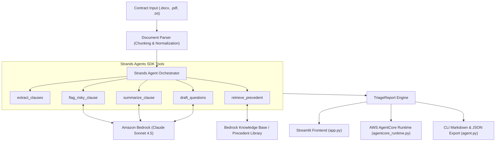

# ClauseGuard 🛡️

> **Autonomous AI Contract Triage Assistant powered by the Strands Agents SDK and Amazon Bedrock**  
> *Built for the AWS "Agents for Humans" Hackathon — Professional Agents Track*

[](https://opensource.org/licenses/MIT)
[](https://www.python.org/)
[](https://github.com/awslabs/strands-agents)
[](https://aws.amazon.com/bedrock/)
[](https://pytest.org)

---

## 🎯 The Pitch: Problem, Audience & Impact

### 1. The Problem We're Solving
Every day, professionals, freelancers, and small business owners face dense 10–30 page legal contracts: freelance agreements, SaaS subscriptions, vendor terms, and commercial leases. 

Hiring a lawyer for routine contracts costs **$300–$800/hour**, leading most small teams to blindly sign without reading. Conversely, doing it manually drains **hours of high-focus attention** deciphering legal jargon, risking catastrophic oversights like uncapped liability, pre-existing IP forfeitures, 18-month non-competes, and accelerated termination penalties.

### 2. Who It's For
- **Freelance Creators & Developers:** Protect your background code libraries, prevent IP forfeiture, and avoid predatory payment lock-ins.
- **Founders & Small-Business Owners:** Rapidly vet SaaS subscriptions, vendor contracts, and office leases without retaining legal counsel for every revision.
- **Agency Leads & Procurement Teams:** Standardize risk evaluation across incoming customer and subcontractor agreements.

### 3. Why It Matters
Instead of building another heavy app you must babysit, ClauseGuard acts as an **autonomous background triage layer**. It operates under a strict principle:

> **Triage, Never Decide.**  
> ClauseGuard never tells you "sign this" or "reject this." It translates routine terms into plain English, isolates genuine asymmetric risks that demand human business judgment, and drafts ready-to-send questions so you can negotiate balanced terms immediately.

---

## 🏗️ Architecture & How It Works

ClauseGuard combines the **Strands Agents SDK**, **Amazon Bedrock (Claude Sonnet)**, and **AWS Bedrock AgentCore Runtime** in a modular multi-tier pipeline:

```
                  ┌─────────────────────────────────────────────────────────┐
                  │                 Contract Input Source                   │
                  │  (.docx, .pdf, .txt Upload | Streamlit UI | API / POST) │
                  └────────────────────────────┬────────────────────────────┘
                                               │
                                               ▼
                  ┌─────────────────────────────────────────────────────────┐
                  │            Tier 1: Document Parsing Layer               │
                  │ (Text Normalisation, Artifact Stripping & Chunking)     │
                  └────────────────────────────┬────────────────────────────┘
                                               │
                                               ▼
                  ┌─────────────────────────────────────────────────────────┐
                  │            Tier 2: Strands Agents Core                  │
                  │   ├── extract_clauses       (Structural section chunks) │
                  │   ├── flag_risky_clause     (7-Category risk scoring)   │
                  │   ├── summarize_clause      (Plain-English translation) │
                  │   ├── draft_questions       (Negotiation coach & Qs)    │
                  │   └── retrieve_precedent    (Market benchmark lookup)   │
                  └───────────────┬─────────────────────────▲───────────────┘
                                  │                         │
                  Bedrock Prompts │                         │ Inferences / Precedents
                                  ▼                         │
                  ┌─────────────────────────────────────────┴───────────────┐
                  │          Tier 3: Reasoning & Knowledge Engine           │
                  │  ├── Amazon Bedrock (Claude Sonnet 3.5 / 4.5)           │
                  │  ├── Amazon Bedrock Knowledge Base (Vector Search)      │
                  │  └── Curated Precedent Library (7 Standard Benchmarks)  │
                  └────────────────────────────┬────────────────────────────┘
                                               │
                                               ▼
                  ┌─────────────────────────────────────────────────────────┐
                  │       Tier 4: Structured Output & Triage Reports        │
                  │  ├── Executive Summary & Risk Badge (HIGH / MED / LOW)  │
                  │  ├── Flagged Clauses (What it says, Why it matters)     │
                  │  ├── Ready-to-Send Counterparty Questions & Compromises │
                  │  ├── Plain-Language Summary of Safe Clauses             │
                  │  └── Silence & Missing Protections Notes                │
                  └───────────────┬─────────────────────────┬───────────────┘
                                  │                         │
                                  ▼                         ▼
                  ┌────────────────────────┐       ┌────────────────────────┐
                  │   Streamlit Web App    │       │   AWS AgentCore microVM│
                  │ (Visual Drag-and-Drop) │       │ (Serverless Cloud Host)│
                  └────────────────────────┘       └────────────────────────┘
```

### Architecture Diagram (Mermaid)



---

## ⚖️ The 7-Category Risk Rubric

ClauseGuard evaluates contract clauses against a battle-tested 7-category risk rubric calibrated against real commercial standards:

| Category | High-Risk Triggers | Calibrated Commercial Standards (Not Flagged) |
|---|---|---|
| **1. FINANCIAL_EXPOSURE** | Uncapped liability, unilateral indemnity, $0 liability disclaimers, un-amortized capital expense pass-throughs. | Standard mutual liability caps (12 months fees), routine lease premises indemnity. |
| **2. IP_AND_RIGHTS** | Pre-existing IP assignment, prior inventions grab, worldwide perpetual moral rights waiver, post-term non-competes. | Standard custom work-for-hire assignment of deliverables created under scope. |
| **3. TERMINATION_AND_LOCKIN** | Asymmetric cancellation rights, >60 day notice, forfeiture of earned fees, accelerated unexpired rent penalties. | Bilateral termination for convenience (30 days) with full payment for delivered work. |
| **4. DISPUTE_RESOLUTION** | Mandatory binding arbitration, waiver of jury trial, waiver of class actions, distant forum selection. | Standard court jurisdiction in commercial centers, preliminary executive escalation. |
| **5. UNILATERAL_MODIFICATION** | Unilateral right to alter pricing, SLAs, or terms at any time with continued use deemed acceptance. | Material changes requiring 30 days notice with penalty-free termination rights. |
| **6. ASYMMETRIC_OBLIGATIONS** | Heightened evidentiary burdens (clear & convincing) on public information, unannounced 24/7 entry without notice. | Standard preponderance of evidence, entry upon 24-hour advance written notice. |
| **7. SILENCE_AND_OMISSIONS** | Silence on liability caps, absence of confidentiality protections, missing governing law. | Complete bilateral protection across all core clauses. |

---

## 🛠️ The 5 Strands Agent Tools

1. **`extract_clauses`**: Parses raw documents (`.docx`, `.pdf`, `.txt`) into clean, numbered sections and nearest headings without data loss or noise.
2. **`flag_risky_clause`**: Applies the 7-category risk rubric using Bedrock Claude Sonnet (with calibrated deterministic fallback) to evaluate whether a clause demands human judgment.
3. **`summarize_clause`**: Translates safe, routine provisions into everyday English (scan in under 10 seconds), extracting specific key obligations and commitments.
4. **`draft_questions`**: For every flagged risk, drafts a ready-to-send Primary Question, a Fallback Question, a market-standard Compromise Position, and a Negotiation Goal.
5. **`retrieve_precedent`**: Queries an Amazon Bedrock Knowledge Base vector index (or the local curated precedent library) to retrieve benchmark contract clauses for redlining.

---

## 🚀 Quickstart & Setup Instructions

### 1. Clone & Setup Environment

```bash
git clone https://github.com/letlotlo-modiba/ClauseGuard.git
cd ClauseGuard
python3 -m venv .venv
source .venv/bin/activate
pip install -r requirements.txt
```

### 2. Configure AWS Credentials (Optional for Local Mode)

Copy `.env.example` to `.env`:

```bash
cp .env.example .env
```

Configure your AWS Bedrock access:
```ini
AWS_ACCESS_KEY_ID=your_access_key_here
AWS_SECRET_ACCESS_KEY=your_secret_key_here
AWS_DEFAULT_REGION=us-east-1
BEDROCK_MODEL_ID=anthropic.claude-sonnet-4-5-20250929-v1:0
```

> **Note on Fallback Mode:** If live AWS credentials are not configured, ClauseGuard automatically engages its **deterministic rubric engine** so all features, benchmarks, and tests run locally without crashing.

---

## 🖥️ Running ClauseGuard

### Option A: Streamlit Interactive Web App (Recommended)

Launch the visual web application:

```bash
streamlit run app.py
```

Features:
- Drag-and-drop `.docx`, `.pdf`, or `.txt` contract uploads
- **1-Click Benchmark Loaders** to test sample contracts instantly
- Visual Risk KPI Scorecards (High, Medium, Low)
- Expandable Flagged Clause cards with 1-click counterparty question copy blocks
- Plain-Language safe clause summaries with bulleted obligations
- 1-Click Markdown and structured JSON export

### Option B: Command-Line Interface (CLI)

```bash
# Print formatted Markdown triage report to terminal
python agent.py sample_contracts/01_freelance_developer_agreement.txt

# Specify contract type context
python agent.py sample_contracts/03_commercial_office_lease.txt --type "Commercial Lease"

# Output structured JSON for automation or UI ingestion
python agent.py sample_contracts/02_saas_subscription_agreement.txt --json

# Save report directly to file
python agent.py sample_contracts/04_consulting_services_nda.txt -o nda_triage_report.md
```

### Option C: AWS AgentCore Runtime MicroVM Deployment

ClauseGuard is fully packaged for the **Amazon Bedrock AgentCore Runtime**:

```bash
# Run local AgentCore HTTP microVM runtime server
python agentcore_runtime.py --server
```

Test health check and agent invocation:
```bash
# Health check (/ping)
curl http://localhost:8080/ping

# Agent invocation (/invocations)
curl -X POST http://localhost:8080/invocations \
  -H "Content-Type: application/json" \
  -d '{
    "document_path": "sample_contracts/01_freelance_developer_agreement.txt",
    "contract_type": "Freelance Agreement"
  }'
```

Docker Container Deployment:
```bash
docker build -t clauseguard-agentcore .
docker run -p 8080:8080 clauseguard-agentcore
```

---

## 📊 Benchmark Suite Validation

ClauseGuard includes 5 realistic fictional contracts with ground-truth answer keys in [`sample_contracts/answer_key.json`](sample_contracts/answer_key.json):

| Benchmark Contract | Contract Type | Tested High-Risk Issues | Ground Truth Expected Flags | ClauseGuard Result |
|---|---|---|---|---|
| `01_freelance_developer_agreement.txt` | Freelance Agreement | Pre-existing IP grab, unilateral indemnity, 18-mo non-compete, invoice forfeiture | **4 flags** (Sec 4, 7, 8, 9) | ✅ **4 flags** |
| `02_saas_subscription_agreement.txt` | SaaS Terms | Auto-renew +25% hike, unilateral terms modification, $0 provider liability cap, mandatory arbitration | **4 flags** (Sec 3, 6, 10, 12) | ✅ **4 flags** |
| `03_commercial_office_lease.txt` | Office Lease | Uncapped capital pass-throughs, 100% accelerated rent liquidated damages, unannounced entry | **3 flags** (Sec 5, 8, 11) | ✅ **3 flags** |
| `04_consulting_services_nda.txt` | Consulting NDA | Shifted evidentiary burden on public info, perpetual duration + non-solicit, unilateral legal fee shifting | **3 flags** (Sec 2, 4, 7) | ✅ **3 flags** |
| `05_safe_standard_vendor_agreement.txt` | Vendor Agreement | Balanced mutual terms, capped liability (12 mo fees), mutual indemnity (Negative Control) | **0 flags** | ✅ **0 flags** |

Run all 47 tests across Week 1, 2, and 3:

```bash
pytest -v
```

```
============================= test session starts ==============================
test_week1.py::TestDocumentParsers (7 tests) ........................... PASSED
test_week1.py::TestStrandsTools (5 tests) .............................. PASSED
test_week1.py::TestBenchmarkContractsSuite (5 tests) ................... PASSED
test_week1.py::TestEndToEndReportFormatting (1 test) ................... PASSED
test_week2.py::TestSummarizeClauseTool (4 tests) ....................... PASSED
test_week2.py::TestDraftQuestionsTool (4 tests) ........................ PASSED
test_week2.py::TestRetrievePrecedentTool (4 tests) ..................... PASSED
test_week2.py::TestCalibrationAgainstSampleContracts (2 tests) ......... PASSED
test_week2.py::TestStructuredTriageReport (4 tests) .................... PASSED
test_week2.py::TestStrandsAgentWeek2Integration (2 tests) .............. PASSED
test_week3.py::TestAgentCoreRuntime (4 tests) .......................... PASSED
test_week3.py::TestAgentCoreHttpProtocol (2 tests) ..................... PASSED
test_week3.py::TestAgentCoreManifestAndDeployment (2 tests) ............. PASSED
test_week3.py::TestStreamlitAppReadiness (1 test) ...................... PASSED
============================== 47 passed in 15.75s ==============================
```

---

## 📈 Observability & CloudWatch Logging

ClauseGuard emits structured JSON logs with correlation IDs (`request_id`, `trace_id`, `latency_ms`, `risk_score`) conforming to AWS CloudWatch and OpenTelemetry standards:

```json
{
  "timestamp": "2026-09-10 19:31:49,724",
  "level": "INFO",
  "logger": "ClauseGuard.AgentCore",
  "message": {
    "event_type": "INVOCATION_COMPLETED",
    "request_id": "d7635f25-2ef8-4c22-9ae0-4868a0488455",
    "trace_id": "aed8b612-c2b2-48eb-85dc-6fcf386b63f5",
    "runtime": "AWS AgentCore Runtime (microVM)",
    "status": "SUCCESS",
    "latency_ms": 62.6,
    "reviewed_clauses": 11,
    "flagged_clauses": 4,
    "risk_score": "HIGH"
  }
}
```

---

## 📜 Repository Structure

```
ClauseGuard/
├── agent.py                      # Core Strands Agent & CLI triage runner
├── agentcore_runtime.py          # AWS AgentCore Runtime wrapper & HTTP microVM protocol
├── agentcore.yaml                # AWS AgentCore deployment manifest
├── app.py                        # Streamlit visual web application
├── clause_tools.py               # 5 Strands Agent tools (extract, flag, summarize, draft, precedent)
├── document_parser.py            # Parser coordinator & factory
├── Dockerfile                    # Container definition for AWS AgentCore / SageMaker deployment
├── models.py                     # Dataclasses & TriageReport dual-format engine
├── parsers.py                    # Concrete parsers for .docx, .pdf, and .txt
├── text_processing.py            # Text normalisation & heading boundary detection
├── prompts.py                    # System prompts, 7-category risk rubric & tool prompts
├── precedents/                   # Curated library of 7 market-standard benchmark clauses
│   ├── bilateral_termination.md
│   ├── commercial_lease_operating_expenses.md
│   ├── mutual_indemnification.md
│   ├── mutual_limitation_of_liability.md
│   ├── saas_subscription_renewal_and_modification.md
│   ├── standard_bilateral_nda.md
│   └── work_product_and_ip_carveout.md
├── sample_contracts/             # 5 benchmark contracts + answer key + .docx test
│   ├── 01_freelance_developer_agreement.txt
│   ├── 02_saas_subscription_agreement.txt
│   ├── 03_commercial_office_lease.txt
│   ├── 04_consulting_services_nda.txt
│   ├── 05_safe_standard_vendor_agreement.txt
│   ├── answer_key.json
│   └── test_contract.docx
├── test_week1.py                 # Week 1 tests (Parsers, tools, chunking)
├── test_week2.py                 # Week 2 tests (Summarize, questions, precedent, calibration)
├── test_week3.py                 # Week 3 tests (AgentCore runtime, HTTP, Streamlit, manifest)
├── requirements.txt              # Project dependencies
└── LICENSE                       # MIT Open Source License
```

---

## 🏆 Hackathon Metadata

- **Track:** Professional Agents
- **Hackathon:** AWS "Agents for Humans"
- **Author:** Letlotlo Modiba
- **License:** MIT License — see [LICENSE](LICENSE)
